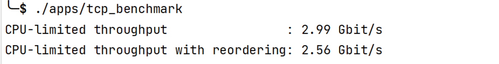
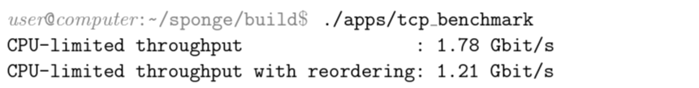

  
Table of Contents

  <ol>
    <li><a href="#about-the-project">About The Project</a></li>
    <li><a href="#env">Env</a></li>
    <li><a href="#labs">Labs</a></li>
    <li><a href="#features">Features</a></li>
    <li><a href="#performance">Performance</a></li>
    <li><a href="#todo">TODO</a></li>
    <li><a href="#tips">Tips</a></li>
  </ol>

# About the Project

该项目来自Stanford [CS144: Introduction to Computer Networking, Fall 2021](https://cs144.github.io/)课程实验。

项目内容：**手写一个TCP/IP协议栈**，并最终能和真实的网络世界进行通信！我花了一周的时间写完了全部实验，并完成了和“外面世界”的通信，感觉很棒！

演示视频：
- [one host, mutil terminals](https://www.bilibili.com/video/BV1Cj411371i/?vd_source=5af8b9727b99a37960b995f039f599e7)
- [two hosts](https://www.bilibili.com/video/BV13D4y137th/?vd_source=5af8b9727b99a37960b995f039f599e7)

# Env

- Ubuntu22.04 in VMware Workstation 17 Pro
- [Tools-list](https://stanford.edu/class/cs144/vm_howto/vm-howto-byo.html)

注：笔者安装的 `g++`, `clang-tidy`, `clang-format` 的版本比 [Tools-list](https://stanford.edu/class/cs144/vm_howto/vm-howto-byo.html) 中的要高，实测没有问题。

# Labs

- [x] Lab0: networking warmup
- [x] Lab1: stitching substrings into a byte stream
- [x] Lab2: the TCP receiver
- [x] Lab3: the TCP sender
- [x] Lab4: the TCP connection
- [x] Lab5: the network interface
- [x] Lab6: the IP router
- [x] Lab7: putting it all together

# Features

- **连续**不下 **70** 次的Lab4完整测试均通过，**鲁棒性良好！**

- lab0-lab7，全部完成，**在真实网络环境中可用。**

# Performance

对TCP的实现进行网络吞吐量的测试，结果如下：

和样例（如下图）相比，性能还可以。

但是和最高相比，

> We ran our reference implementation on a 2011 Intel Core i7-2600K CPU @ 4.40GHz with Ubuntu 19.04, Linux 5.0.0-31-generic #33-Ubuntu with default mitigations against Meltdown/Spectre/etc., and g++ 8.3.0 with the default compiler flags for a default (“Release”) build. The CPU-limited throughput (first line) was 7.18 Gbit/s, and (second line) 6.84 Gbit/s with reordering.

显得微不足道。

# TODO

1. 对程序进行性能进行优化，提高网络吞吐量。
2. 对 `TCP` 的实现进行重构改写。目前实现的方式并不是按照 `FSM` (**F**inite **S**tate **M**achine)的方式进行的，导致代码看起来有点混乱。使用 `FSM` 感觉可以很好解决这个问题。但这个想法可能会被搁置很久~

# Tips

调试技巧：

1. `TTD`. 对于lab1-lab3，笔者建议仔细查看思考测试程序给的提示信息，除此之外，查看测试源程序也是一个很好的办法。总之 `TTD` 的办法，能够很好的 cover 所有的需求。虽然可能有潜在的在特定场景下的 bugs.

2. `Log`. 对于lab4，部分测试程序并不能查看源码。此时建议在**关键**地方 `Log`，笔者建议的地方是：在每一个 `Segment` 发送都 `Log`，这样很容易结合 `FSM` 分析处问题。

3. 单个测试程序而不是全部。对于**概率**通过的测试程序，建议单独拎出来进行测试。
    
    例如单独测试 `t_ucR_16_1`， 在 `build` 目录下运行 `ctest --output-on-failure -V -R 't_ucR_16_1'` 即可。其中`--output-on-failure` option 用于输出 `cerr` 内容。

4. 概率通过 === BUG ！如果你发现你的程序时而通过，时而不通过；或者总是有几个，十几个，几十个测试程序不能通过。那么，**不用辩解，你的程序有问题**。建议完成后，多测试！毕竟**丢包是概率的！** 只有在 **任何** 场景下都可以通过，才算真正完成。